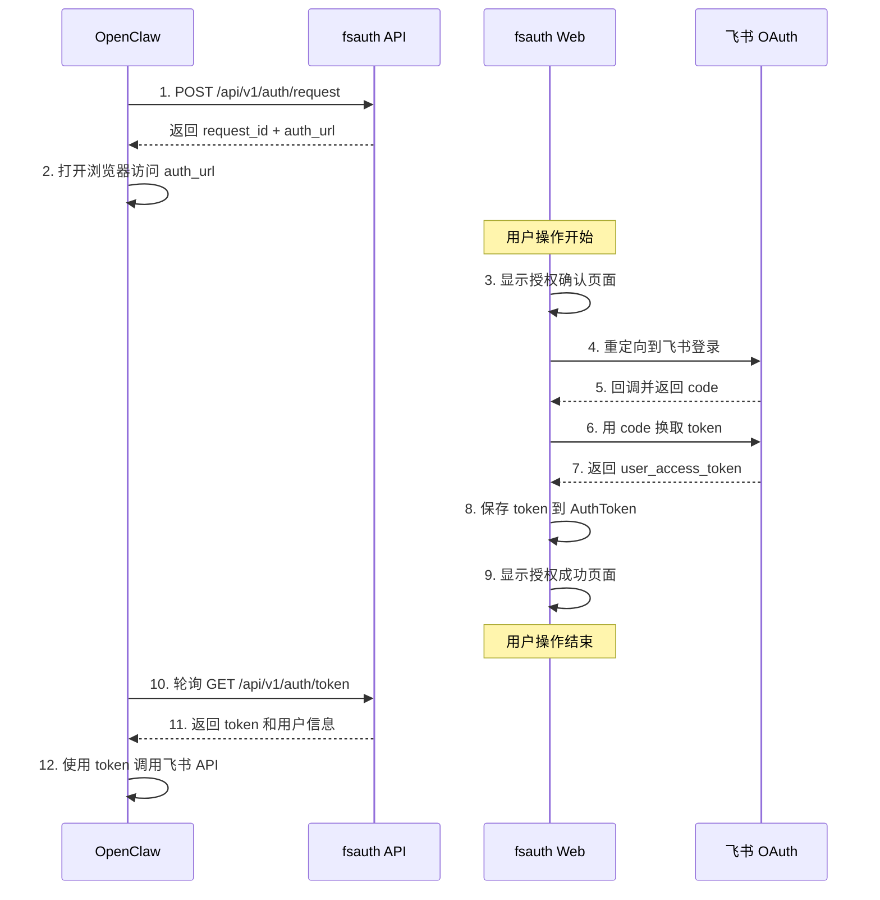

# fsauth 项目架构文档

## 架构概览

fsauth 采用经典的 MVC 架构，基于 Ruby on Rails 7.2 框架构建。

```
┌─────────────┐         ┌─────────────┐         ┌─────────────┐
│  OpenClaw   │────────▶│   fsauth    │────────▶│   飞书      │
│  (本地)     │  HTTP   │  (HTTPS)    │  OAuth  │   OAuth     │
└─────────────┘         └─────────────┘         └─────────────┘
      │                       │                       │
      │                       │                       │
      │     Token             │    Token              │
      ◀───────────────────────┴───────────────────────┘
           轮询获取
```

## 核心组件

### 1. 数据模型 (Models)

#### AuthRequest
授权请求模型，记录每次授权流程的状态。

```ruby
# app/models/auth_request.rb
class AuthRequest < ApplicationRecord
  belongs_to :application
  validates :request_id, presence: true, uniqueness: true
  validates :state, inclusion: { in: %w[pending authorized expired failed] }
  
  # 状态机
  # pending → authorized | expired | failed
  
  scope :valid_requests, -> { pending.where('expires_at > ?', Time.current) }
  
  def valid_request?
    state == 'pending' && !expired?
  end
end
```

**字段说明：**
- `request_id` (string): UUID，唯一标识每个授权请求
- `application_id` (uuid): 关联的应用 ID
- `state` (string): 授权状态（pending/authorized/expired/failed）
- `expires_at` (datetime): 过期时间（默认 10 分钟）

#### AuthToken
临时存储 token，供轮询获取。

```ruby
# app/models/auth_token.rb
class AuthToken < ApplicationRecord
  serialize :auth_data, coder: JSON
  
  belongs_to :auth_request, foreign_key: :request_id, 
             primary_key: :request_id, optional: true
  
  validates :token, presence: true
end
```

**字段说明：**
- `request_id` (string): 关联的授权请求 ID
- `token` (text): 飞书返回的 user_access_token
- `auth_data` (json): 用户信息（open_id, name 等）

### 2. 控制器 (Controllers)

#### AuthsController
处理用户授权流程（HTML 响应）。

```ruby
# app/controllers/auths_controller.rb
class AuthsController < ApplicationController
  # GET /auth/start?request_id=xxx
  def start
    # 显示授权确认页面
  end
  
  # POST /auth/authorize
  def authorize
    # 重定向到飞书 OAuth
  end
  
  # GET /auth/feishu/callback
  def feishu_callback
    # 处理飞书回调，获取 token
  end
end
```

**路由：**
- `GET /auth/start` - 授权确认页面
- `POST /auth/authorize` - 发起飞书 OAuth
- `GET /auth/feishu/callback` - 飞书回调处理

#### Api::V1::AuthApisController
API 端点（JSON 响应）。

```ruby
# app/controllers/api/v1/auth_apis_controller.rb
class Api::V1::AuthApisController < ApplicationController
  # POST /api/v1/auth/request
  def create_request
    # 创建授权请求，返回 request_id 和 auth_url
  end
  
  # GET /api/v1/auth/token?request_id=xxx
  def get_token
    # 返回 token（如果授权完成）
  end
  
  # GET /api/v1/auth/status?request_id=xxx
  def get_status
    # 返回授权状态
  end
end
```

### 3. 服务层 (Services)

#### FeishuAuthService
封装飞书 OAuth 操作。

```ruby
# app/services/feishu_auth_service.rb
class FeishuAuthService
  def initialize
    @app_id = ENV['FEISHU_APP_ID']
    @app_secret = ENV['FEISHU_APP_SECRET']
    @redirect_uri = ENV['FEISHU_OAUTH_REDIRECT_URI']
  end
  
  # 生成授权 URL
  def authorization_url(state:)
    # 返回飞书 OAuth URL
  end
  
  # 用 code 换取 token
  def exchange_code_for_token(code:)
    # 调用飞书 API 获取 user_access_token
  end
  
  # 获取用户信息
  def get_user_info(access_token:)
    # 调用飞书 API 获取用户详情
  end
end
```

### 4. 前端 (Views + JavaScript)

#### 视图层
- `home/index.html.erb` - 主页（产品介绍）
- `auths/start.html.erb` - 授权确认页面
- `auths/success.html.erb` - 授权成功页面
- `auths/expired.html.erb` - 授权过期页面

#### Stimulus Controllers
- `auth_callback_controller.ts` - 处理授权成功后的逻辑

## 授权流程详解

### 完整流程图



### 状态转换

```
AuthRequest.state 状态机:

   ┌─────────┐
   │ pending │ ◀── 初始状态（创建授权请求）
   └────┬────┘
        │
        ├──────────▶ authorized   （授权成功）
        ├──────────▶ expired      （超过 10 分钟）
        └──────────▶ failed       （授权失败或用户拒绝）
```

### 关键时序

1. **创建请求** (0s)
   - openclaw 调用 `POST /api/v1/auth/request`
   - fsauth 创建 AuthRequest (state=pending)
   - 返回 request_id 和 auth_url

2. **用户授权** (0-600s)
   - 用户在浏览器中完成飞书登录
   - fsauth 获取 token 并保存到 AuthToken
   - AuthRequest.state 更新为 authorized

3. **轮询获取** (0-600s)
   - openclaw 每 2-3 秒轮询 `GET /api/v1/auth/token`
   - 如果 state=authorized，返回 token
   - 如果 state=pending，返回等待消息
   - 如果 state=expired，返回过期错误

4. **过期处理** (>600s)
   - AuthRequest 自动标记为 expired
   - 轮询返回过期错误
   - 需要重新发起授权

## 数据库设计

### 表结构

#### auth_requests

| 字段 | 类型 | 说明 |
|------|------|------|
| id | bigint | 主键 |
| request_id | string | UUID，唯一标识 |
| application_id | uuid | 关联的应用 ID |
| state | string | pending/authorized/expired/failed |
| expires_at | datetime | 过期时间 |
| created_at | datetime | 创建时间 |
| updated_at | datetime | 更新时间 |

**索引：**
- `index_auth_requests_on_request_id` (unique)
- `index_auth_requests_on_state`
- `index_auth_requests_on_expires_at`

#### auth_tokens

| 字段 | 类型 | 说明 |
|------|------|------|
| id | bigint | 主键 |
| request_id | string | 关联 auth_requests.request_id |
| token | text | user_access_token |
| auth_data | json | 用户信息 |
| created_at | datetime | 创建时间 |
| updated_at | datetime | 更新时间 |

**索引：**
- `index_auth_tokens_on_request_id` (unique)

## 安全设计

### 1. HTTPS 强制
生产环境强制使用 HTTPS，满足飞书 OAuth 安全要求。

### 2. Token 不持久化
AuthToken 仅用于临时存储（供轮询获取），不作为长期存储。建议定期清理过期记录。

### 3. 请求过期机制
授权请求 10 分钟自动过期，防止 request_id 被滥用。

### 4. UUID 标识
使用 UUID 作为 request_id，避免可预测性攻击。

### 5. CORS 隔离
API 端点与 Web 端点分离，API 支持 JSON 响应，Web 端点仅返回 HTML。

## 配置管理

### 环境变量

使用 Figaro 管理配置（`config/application.yml`）：

```yaml
FEISHU_APP_ID: 'cli_xxx'
FEISHU_APP_SECRET: 'xxx'
FEISHU_OAUTH_REDIRECT_URI: '<%= ENV.fetch("PUBLIC_HOST", "http://localhost:3000") %>/auth/feishu/callback'
```

### 多环境配置

- **开发环境**: `config/environments/development.rb`
- **生产环境**: `config/environments/production.rb`
- **测试环境**: `config/environments/test.rb`

## 性能优化

### 1. 数据库索引
所有查询字段都建立了索引：
- request_id (unique)
- state
- expires_at

### 2. 缓存策略
- 使用 Rails 缓存机制缓存飞书 API 响应
- AuthToken 自动清理（可配置定时任务）

### 3. 轮询优化
建议客户端：
- 轮询间隔 2-3 秒
- 超时时间 5 分钟
- 指数退避策略（可选）

## 监控与日志

### 日志级别
- **development**: debug
- **production**: info

### 关键日志点
1. 授权请求创建
2. 飞书 OAuth 回调
3. Token 获取
4. 错误和异常

### 监控指标
- 授权请求创建数量
- 授权成功率
- 授权平均耗时
- API 响应时间

## 扩展性

### 水平扩展
- 无状态设计，支持多实例部署
- 共享数据库存储状态
- 负载均衡器分发请求

### 存储扩展
- PostgreSQL 支持读写分离
- Redis 可用于缓存（可选）
- 定期清理过期数据

## 测试策略

### 单元测试
- Model 验证和方法测试
- Service 层业务逻辑测试

### 集成测试
- API 端点测试
- 授权流程端到端测试

### 架构验证
- Stimulus 集成验证
- Turbo Stream 架构验证
- 项目约定验证

运行测试：
```bash
bundle exec rake test
```

## 部署架构

### 推荐部署方案

```
                    ┌─────────────────┐
                    │  Load Balancer  │
                    │   (Nginx/ALB)   │
                    └────────┬────────┘
                             │
              ┌──────────────┼──────────────┐
              │              │              │
         ┌────▼────┐    ┌────▼────┐   ┌────▼────┐
         │ fsauth  │    │ fsauth  │   │ fsauth  │
         │ App #1  │    │ App #2  │   │ App #3  │
         └────┬────┘    └────┬────┘   └────┬────┘
              │              │              │
              └──────────────┼──────────────┘
                             │
                    ┌────────▼────────┐
                    │   PostgreSQL    │
                    │    Database     │
                    └─────────────────┘
```

### 容器化部署

参考 `Dockerfile` 和 `docker-compose.yml`。

## 故障恢复

### 常见问题处理

1. **数据库连接失败**
   - 检查 DATABASE_URL 配置
   - 验证数据库服务状态

2. **飞书 API 调用失败**
   - 检查 FEISHU_APP_ID/SECRET
   - 验证重定向 URL 配置

3. **授权一直 pending**
   - 检查飞书回调是否到达
   - 查看 Rails 日志错误信息

## 相关文档

- [使用指南](usage.md)
- [快速开始](../QUICKSTART.md)
- [API 参考](usage.md#api-参考)
- [部署指南](usage.md#生产环境部署)

---

最后更新：2024-01-01
